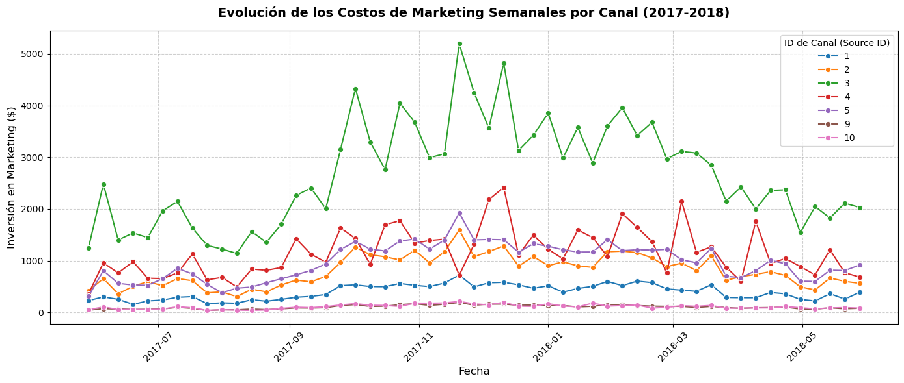
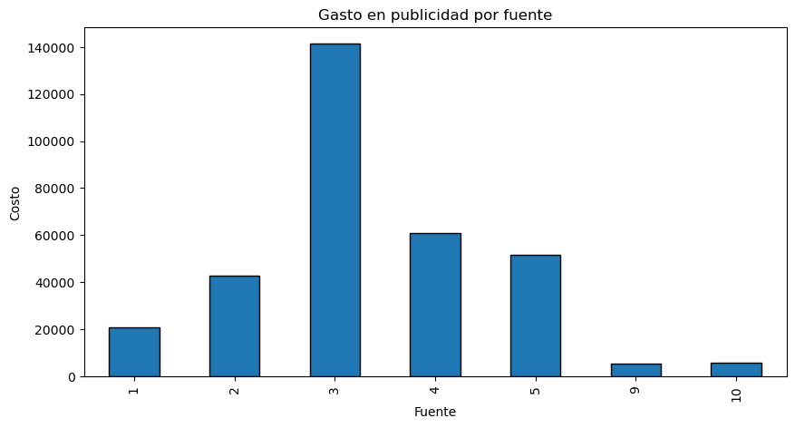
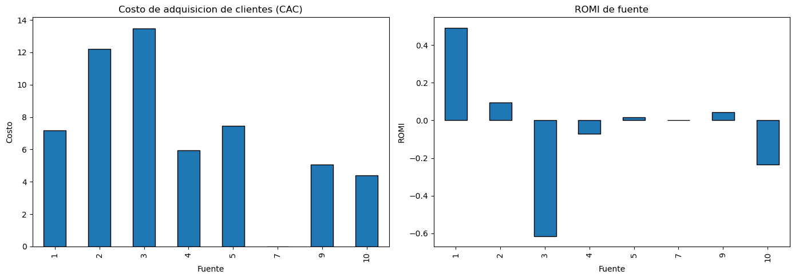

# 📊 Optimización del ROI y Comportamiento del Consumidor
### Auditoría del customer journey y el presupuesto de marketing de una plataforma de venta de entradas (2017-2018)

---

## 📌 Descripción del Proyecto

**Showz**, una plataforma de venta de entradas para eventos, necesita auditar y optimizar su estrategia de marketing digital. A partir de registros de servidor, transacciones y presupuestos publicitarios entre 2017 y 2018, se analizó el **customer journey** completo: frecuencia de uso, velocidad de conversión, valor del tiempo de vida del cliente (**LTV**), costo de adquisición (**CAC**) y retorno de la inversión en marketing (**ROMI**).

El resultado es un conjunto de recomendaciones basadas en datos para redistribuir el presupuesto publicitario hacia los canales y dispositivos más rentables.

---

## 🎯 Objetivo del negocio

Determinar qué canales de marketing generan un retorno real sobre la inversión, para ayudar al equipo comercial a:

✔ Reasignar presupuesto hacia los canales más eficientes
✔ Detectar canales que operan con pérdidas
✔ Entender el ciclo de vida y la retención del cliente
✔ Aumentar el LTV y sostener el crecimiento a largo plazo

---

## 🧠 Preguntas de análisis

- ¿Cuántas personas usan la plataforma cada día, semana y mes?
- ¿Con qué frecuencia regresan los usuarios?
- ¿Cuánto tiempo tardan en convertir desde su primera visita?
- ¿Cuánto dinero traen los clientes a lo largo de su ciclo de vida (LTV)?
- ¿Cuánto se invirtió en marketing y cuál fue el costo de adquisición por canal (CAC)?
- ¿Qué canales son rentables y cuáles generan pérdidas (ROMI)?

---

## 📂 Dataset utilizado

| Dataset | Descripción |
|---|---|
| `visits_log_us.csv` | Registro de sesiones: dispositivo, canal de origen, inicio/fin de sesión y usuario (359.400 registros) |
| `orders_log_us.csv` | Registro de pedidos: fecha de compra, ingreso y usuario (50.415 pedidos) |
| `costs_us.csv` | Gasto en marketing por canal y fecha (2.542 registros) |

**Periodo cubierto:** 2017 – 2018

---

## ⚙️ Proceso realizado

### 1️⃣ Carga y exploración de datos
- Revisión de estructura y tipos de datos en las tres fuentes
- Confirmación de ausencia de valores nulos

---

### 2️⃣ Limpieza y transformación
✔ Estandarización de columnas a formato `snake_case`
✔ Conversión de columnas de fecha a `datetime`
✔ Creación de variables temporales (semana, cohortes, duración de sesión)

---

### 3️⃣ Métricas de visitas (engagement)
📅 Usuarios únicos: 908 diarios · 5.716 semanales · 23.228 mensuales
🔁 Sesiones: 987 diarias · 6.781 semanales (evidencia de recurrencia por usuario)
⏱ Duración promedio de sesión: 10,7 minutos
🔄 Frecuencia de retorno promedio: 4,01 semanas entre visitas

---

### 4️⃣ Métricas de ventas
🛒 Conversión: la mayoría de los usuarios compra dentro de la semana 0 (primeros 7 días)
📈 Pedidos semanales: promedio cercano a 900, con estacionalidad de fin de año
💵 Ticket promedio por compra: $4,99
📊 LTV acumulado por cohortes semanales (mapa de calor)

---

### 5️⃣ Métricas de marketing
💰 Costo total de marketing: $329.131,62
🧮 Cálculo de CAC (costo / clientes adquiridos) y ROMI (ingreso - costo) / costo por canal

---

## 📈 Hallazgos principales

### 🔁 Engagement y retención
El seguimiento **semanal** es el más útil para detectar tendencias: el análisis diario es demasiado ruidoso y el mensual reacciona tarde. La ventana crítica de retención se concentra en el primer mes de actividad, con un pico de retorno cercano a las 4 semanas (ciclo mensual de consumo).

---

### 💵 Valor del cliente (LTV)
El ticket inicial es estable (~$4,99) en casi todas las cohortes, con crecimiento orgánico lento semana a semana. La cohorte del **18 de septiembre de 2017** es una anomalía: su LTV se dispara después de la semana 11, superando los $25 por usuario — un caso de estudio para replicar la campaña o evento que lo generó.

---

### 📢 Costos y rentabilidad por canal

| Canal | CAC | ROMI | Diagnóstico |
|---|---|---|---|
| 1 | $7,19 | +49,2% | ✅ Altamente rentable |
| 2 | $12,21 | +9,6% | ⚠️ Rentabilidad marginal (break-even) |
| 3 | $13,49 | −61,4% | 🔴 Mayor volumen, pero opera con pérdidas |
| 4 | $5,93 | −7,2% | 🟡 Alto potencial, pérdida mínima |
| 5 | $7,47 | +1,7% | ⚠️ Rentabilidad marginal |
| 9 | $5,07 | +4,4% | ✅ Eficiente |
| 10 | $4,38 | −23,6% | 🔴 Bajo costo pero pérdidas sostenidas |

El **Canal 3** concentra la mayor inversión ($141.321,62) y el mayor volumen de usuarios (10.473), pero también el CAC más alto y un ROMI fuertemente negativo. El **Canal 4** atrae casi el mismo volumen (10.296 usuarios) con una inversión mucho menor, lo que lo convierte en la mayor oportunidad de optimización.

---

## 📊 Conclusiones

### ✅ El engagement es sólido, pero concentrado al inicio
Los usuarios convierten rápido (dentro de la primera semana) y regresan con un ciclo mensual, lo que sugiere enfocar la fidelización en los primeros 28 días.

### ✅ El presupuesto está mal distribuido
El canal con mayor inversión (3) es el menos rentable, mientras que canales con inversión similar en volumen de usuarios (4) o menor costo (1, 9) son más eficientes.

### ✅ Existe una anomalía de alto valor sin explotar
La cohorte de septiembre 2017 alcanzó un LTV excepcional; identificar y replicar su causa representa una oportunidad de negocio.

---

### 🚀 Recomendaciones finales
1. **Reasignar presupuesto del Canal 3 al Canal 4**, que tiene tracción similar con menor inversión y pérdida mínima.
2. **Auditar y optimizar el Canal 2**, que está en punto de equilibrio pero no genera pérdidas.
3. **Mantener el Canal 1** bajo monitoreo continuo por su alta rentabilidad.
4. **Descontinuar el Canal 10**, cuyo bajo volumen no compensa sus costos fijos.
5. **Combinar la optimización de adquisición con estrategias de retención** (fidelización, remarketing a los 28 días) para incrementar el LTV a largo plazo.

---

## 🛠 Tecnologías utilizadas

| Herramienta | Uso |
|---|---|
| Python | Análisis |
| Pandas | Manipulación de datos |
| NumPy | Procesamiento numérico |
| Matplotlib | Visualización |
| Seaborn | Cohortes y mapas de calor |
| Jupyter Notebook | Desarrollo |

---

## 📷 Vista del proyecto

### 📉 Evolución de los costos de marketing por canal

### 📢 Gasto en publicidad por fuente

### 💰 CAC y ROMI por canal

---

## 👨‍💻 Autor

**Carlos Guerrero**
Administrador de Negocios Internacionales → Data Analyst
📊 Python | SQL | Visualización | Estadística | Storytelling con datos

